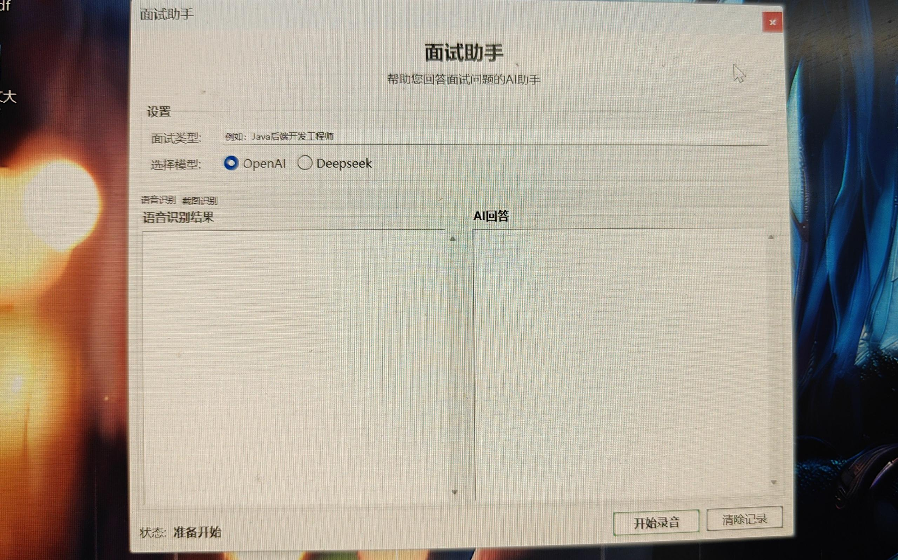
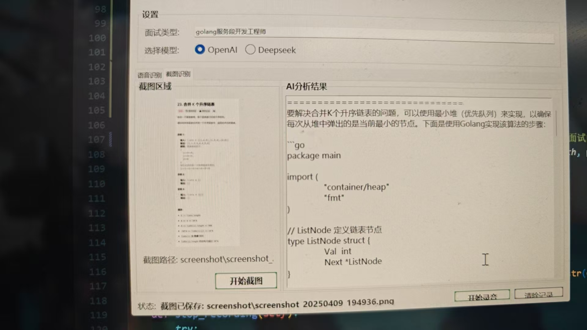

# 🧠💼 面试宝典｜AI助攻你的每一场面试

> 🎯 **程序员跳槽 / 留学申请 / 技术面试准备**

> 🧑‍💻 不用再死记八股文、不用对着镜子尬练、不用一个人默默焦虑。

> 🤖 面试宝典，就是你的「AI模拟官 + 技术搭子 + 语音教练 + 力扣外挂」。


---

## ✨ 为什么我们做这个项目？

我们都太熟悉那种感觉了：

* 😵‍💫 刷了上百题，还是答不清楚
* 🗣️ 面试自我介绍讲十遍都不顺
* 🤐 一被追问就脑袋空白
* 🙁 没人陪练、没人给反馈，效率拉胯

所以我们造了这个工具，给你一个：

✅ 会提问的面试官 👨‍🏫
✅ 懂八股文也能讲人话的技术AI 🧑‍💻
✅ 说错话也不会嘲笑你的语音助手 🎧
✅ 永远耐心、随叫随到的陪练搭子 🤝

---

## 💡 面试宝典能做什么？

| 💭 你在担心...       | ✅ 我们帮你解决！                 |
| ---------------- | ------------------------- |
| “没人陪我练面试...”     | 🤖 多轮对话模拟真实面试             |
| “我英文说不清楚...”     | 🗣️ 阿里云语音识别 + AI纠错 + 语句反馈 |
| “我不知道会被问啥...”    | 🧠 根据岗位/学校/简历，智能生成高频问题    |
| “刷题太枯燥了...”      | 🖼️ 力扣截图一发，AI直接秒讲解        |
| “我不知道自己讲得怎么样...” | 📊 自动打分 + 建议 + 结构反馈（不是虚的） |
| “怕被面试监考抓屏...”    | 🔐 防切屏、防录屏、防截图、防共享，沉浸式练习！ |

---

## 🛠️ 功能速览

| 功能模块      | 图标    | 描述                |
| --------- | ----- | ----------------- |
| 🎤 语音识别   | 🧏‍♂️ | 阿里云语音识别，自动分句、识别语气 |
| 🤖 AI作答   | 🧑‍🏫 | 简洁回答 + 详细解释，一问两答  |
| 📸 截图解题   | ✂️    | 一键截图，自动OCR + 解题   |
| 🧠 结构化反馈  | 📈    | 回答内容、逻辑、语言全分析     |
| 🔐 防作弊机制  | 🛡️   | 防切屏、防录屏、防共享、防截图   |
| 🖥️ GUI界面 | 🖱️   | 支持多显示器，自适应截图区域    |

---

## 🚀 如何使用？

### 🧩 安装依赖

```bash
git clone https://github.com/haynb/msbd
cd msbd
pip install -r requirements.txt
```

### 🔑 配置API（一次性）

* 阿里云语音识别：[注册入口](https://ai.aliyun.com/nls)

  * `access_key_id`, `access_key_secret`, `app_key`, `region_id`
* LLM（任选其一）：

  * OpenAI：[https://platform.openai.com](https://platform.openai.com)
  * DeepSeek：[https://www.deepseek.com](https://www.deepseek.com)

> 🧠 第一次运行程序时，会自动创建配置文件：
> `config/config.json` 👉 只要填进去这些 key，就可以开始啦！

---

## 💻 项目结构

```text
📦 msbd
├── main.py               👈 程序入口
├── config/               🧩 配置管理
├── ui/                   🖥️ 图形界面（PyQt）
├── llm/                  🤖 大模型接口
├── screenshot/           ✂️ 屏幕截图功能
├── sound_capture/        🎤 音频录制
├── speech_recognition/   🗣️ 语音识别
├── imgs/                 🖼️ 示例图片
├── requirements.txt      📦 依赖包列表
└── main.spec             🔧 打包配置
```

---

## 📷 示例展示（真的很像一场面试）

<p align="center">
    
  
</p>

---

## 🔥 未来计划（持续打磨中）

* [ ] 🧾 面试记录导出（PDF）
* [ ] 🧠 逻辑链评分系统 + 可视化表达结构图
* [ ] 🌐 Web端版本 + 用户账户系统
* [ ] 📊 长期成长记录 + 自适应推荐训练
* [ ] 🧑‍🏫 “面试官” 角色互动（企业侧合作）

---

## 🙌 这个项目适合谁？

* 📚 正在准备 **出国申请** 的你（研究型、硕博申请）
* 💼 想要 **跳槽/转岗** 的你（后端、算法、客户端岗位）
* 🧑‍🎓 **毕业前想练练面试** 的你
* 🤖 想要有一个 AI 搭子陪练，不想一个人瞎忙的你

---

## 💬 用户的声音（期待你的反馈）

> “AI比我对象还会提问 😂”
> “本来只想试试截图解题，结果模拟面试停不下来了...”
> “语音+结构评分太强了，真的像一个耐心的面试官。”

---

## ⭐ 如果你也认同这个方向

请给我们一个 Star ⭐，让我们知道你在。
也欢迎：

* 🔁 分享给朋友、同事、学弟妹
* 🧑‍💻 提PR，贡献prompt、优化界面、构建知识库
* 🧠 给我们点建议：[jackiezeng527@gmail.com]

---

## ❤️ 最后想说一句：

> **认真准备的人，值得被认真对待。**
> 你负责努力，我们负责让你的每一份努力更有价值。

---


